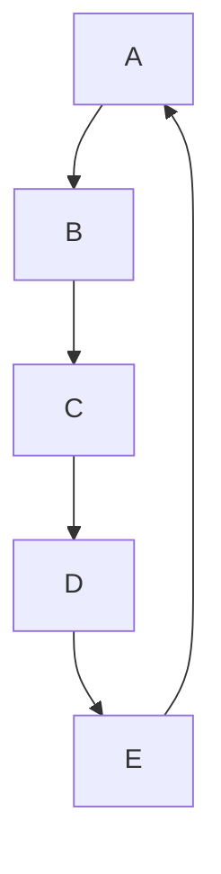

## 做法

修改 `themes/cactus/_config.yml` 檔，新增 `mermaid` 欄位。

```yaml
# Enable or disable the mermaid chart.
mermaid:
  enable: true
```

安裝 `hexo-filter-mermaid-diagrams` 依賴套件。

```bash
npm install hexo-filter-mermaid-diagrams
```

修改 `themes/cactus/layout/_partial/scripts.ejs` 檔。

```ejs
<!-- Mermaid chart -->
<% if (theme.mermaid.enable){ %>
    <script src='https://unpkg.com/mermaid@7.1.2/dist/mermaid.min.js'></script>
<% } %>
```

使用 `mermaid` 語法標記，將「`.`」符號刪除後使用。

```bash
\.\.\mermaid
graph TD;
    A-->B;
    B-->C;
    C-->D;
    D-->E;
    E-->A;
\.\.\
```

繪製出的流程圖如下。


